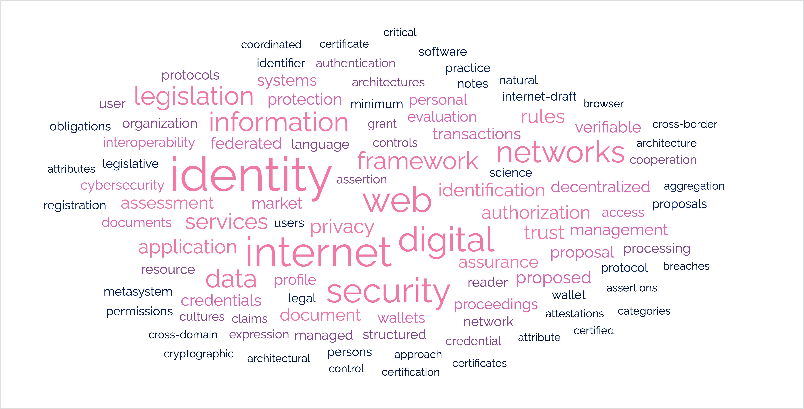
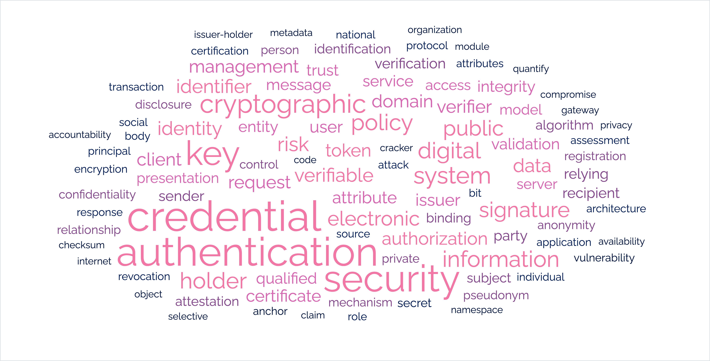

## A brief (opinionated) history of the Web

::: {.list-table .r-stretch .center header-rows=1}
- - Web
  - Interoperability of
  - Decentralizes
  - Key standards
  - Abstraction
  - Flexibility
- - **1.0**
  - information
  - output
  - HTTP
  - messages
  - methods, codes, headers ...
- - **2.0**
  - interaction
  - production
  - DOM/JS
  - objects/events
  - classes, properties, inheritance ...
- - **2.1**
  - authorization
  - control
  - SAML/OAuth
  - (capability) tokens
  - flows, types, parameters ...
- []{.fragment fragment-index=1 .highlight-red}
  - **2.2**
  - identification
  - identity
  - OpenID
  - credentials
  - flows, types, parameters ...
- []{.fragment fragment-index=1 .highlight-red}
  - ***3.0***
  - *identification*
  - *identity*
  - *OpenID*
  - *credentials*
  - *flows, types, parameters ...*

<!--
- - **3.0**
  - **authentication**
  - **trust**
  - ?
  - ?
  - ?
-->
:::

---

Open: no cost required to participate
Decentral: no permission needed to participate
Neutral: no minimum quality of service required to participate
Accessible: no special circumstances required to participate

Universality: interoperability of language is all that is required

    Accessibility: transparent, free of charge, and accessible to everyone without discrimination

    Vendor Neutrality: managed independently of any single entity

    Interoperability: guarantees that different systems, devices, and applications can work together seamlessly

    Evolvability: designed to adapt to changing technological requirements and industry advancements over time

    Legal Freedom: free from legal or technical clauses that limit usage by any party or business model

## OpenID4VCI/VP: Reinventing the wheel?

[New **trust model**]{.underline}: a '*paradigm shift*' towards **user-centricity**, increasing ***portability***, ***privacy***, and ***control***.

<!-- **federated models**, in which an issuer -- in a trust relationship with the verifier -- provides credentials *just-in-time*

**decentralization**
: the principal is put "in the center of the exchange between the verifier and the credential issuer" -->

::: {.center}
- **Portability**
  - [Bring Your Own Identity]{.fragment .semi-fade-out fragment-index=5}
    [... like OpenID Connect *]{.fragment .fade-in-then-semi-out .remark-oidc fragment-index=4}
  - [Offline/asynchronous availability]{.fragment .semi-fade-out fragment-index=5}
    [... like OpenID Connect *]{.fragment .fade-in-then-semi-out .remark-oidc fragment-index=4}
  - [No pre-established verifier--issuer relations]{.fragment .semi-fade-out fragment-index=2}
    [... apart from *trust* relations]{.fragment .fade-in-then-semi-out .remark-nope fragment-index=1}
- **Privacy**
  - [Presentation without issuer]{.fragment .semi-fade-out fragment-index=5}
    [... like OpenID Connect *]{.fragment .fade-in-then-semi-out .remark-oidc fragment-index=4}
  - [Verification without issuer]{.fragment .semi-fade-out fragment-index=3}
    [... impossible for PKI-based proofs]{.fragment .fade-in-then-semi-out .remark-nope fragment-index=2}
- **Control**
  - [Informed consent]{.fragment .semi-fade-out fragment-index=5}
    [... like OpenID Connect *]{.fragment .fade-in-then-semi-out .remark-oidc fragment-index=4}
  - [Selective disclosure]{.fragment .semi-fade-out fragment-index=4}
    [... not needed without wallets]{.fragment .fade-in-then-semi-out .remark-nope fragment-index=3}
:::

:::{.fragment .fade-in .remark-oidc .fn-custom fragment-index=5}
OpenID Connect + Self-Issued OpenID Providers + Claims Aggregation + Identity Assurance
:::

<!-- OpenID's specifications stress that for *privacy considerations*, wallets "should ***not*** store credentials longer than needed". In fact, since "presentation sessions ... can be linked on the basis of unique values encoded in the credential," wallets are advised to use "a **unique** credential per presentation or per verifier" to avoid such correlation -- "each with unique issuer signatures \[and] keys" -- and then discarding the credential ... Moreover, caching becomes useless in case the issuer and wallet follow the advise to use a *unique key* per credentials and a *unique credential* per presentation. -->
<!-- Finally, even if OpenID's architecture would successfully prevent issuers from learning about the user's activity at relying parties, it would have achieved this by introducing a new intermediary entity -- the wallet -- who will possess the same information instead. -->

## Abstraction: a model of ~~*identity*~~ **authentication**

::::{.columns}

:::{.column}

**Identity**: *(Partial) identities are sets of measureable **characteristics**, which together suffice to **represent** an entity and (partially) **distinguish** it from other entities within a certain context.*

:::

:::{.column}

**Authentication**: *Verifying the **authenticity** -- origin and integrity -- of an entity, by corroborating its presented characteristics with information previously associated with it.*

:::

::::

---

### Applicability?

:::: {.list-table}
- - Claim
  - Evidence
  - Binding
  - Trust
- []{.fragment}
  - I know the password.
  - presented password
  - stored password
  - database
- []{.fragment}
  - Pieter is a member of the club.
  - membership card (serial, hologram)
  - serial list
  - tamperproof card
- []{.fragment}
  - These bank statements are legit.
  - bank's (digital) signature
  - bank's public key
  - bank, key infrastructure
- []{.fragment}
  - De Krook's energy score is `C+`.
  - TLS certificate of cadaster
  - certificate chain
  - cadaster, browser, CA
- []{.fragment}
  - My name is Wouter.
  - me telling you so
  - me telling you so
  - me
::::

<!-- :::{.fragment} -->
**Ideal abstraction**  
To check whether [*any sort of **claims***]{rn-type=strike-through} are backed up by *any form of **evidence***.
<!-- ::: -->

<!-- :::{.fragment} -->
**OpenID's abstraction**  
To check whether ***static*** sets of ***attribute--value*** pairs about a ***single person*** have the correct ***signature***.
<!-- ::: -->

<!-- table with why ? -->
<!-- EUDI's abstraction: ... qualified ... -->

## EU Regulations

. . .

**eIDAS** (2014)

  - Trust Services: *digital identity solutions* involved in authentication processes
  - Qualification: elevated status adhering to extra requirements
  - (Informative) Trusted Lists: verification material of Trust Service Providers

. . .

[**⋮**]{style="margin-left:1.5ex"}

**EUDI** (2024)

  - Digital identity wallet
  - (Normative) Trusted Lists
  - OpenID4VCI/VP architecture

---

Service identity
- TLS + EV: CA/B consensus, experienced/relevant industry experts, multi-stakeholder, mature transparent root programs
- QWAC: registrar dictate, inexperienced/irrelevant government-officials, single stakeholder, new vague legislation

User identity
- OpenID Connect: federation consensus, relevant stakeholders, mature standards, technical requirements
- EUDI: registrar dictate, irrelevant government-officials, new standards,  economic/administrative requirements

::: {.list-table .r-stretch .center header-rows=1}
- - Web
  - Interoperability of
  - Decentralizes
  - Key standards
  - Abstraction
  - Flexibility
- - **1.0**
  - information
  - output
  - HTTP
  - messages
  - methods, codes, headers ...
- - **2.0**
  - interaction
  - production
  - DOM/JS
  - objects/events
  - classes, properties, inheritance ...
- - **2.1**
  - authorization
  - control
  - SAML/OAuth
  - (capability) tokens
  - flows, types, parameters ...
- []{.fragment fragment-index=1 .highlight-red}
  - **2.2**
  - identification
  - identity
  - OpenID
  - credentials
  - flows, types, parameters ...
- []{.fragment fragment-index=1 .highlight-red}
  - ***3.0***
  - *identification*
  - *identity*
  - *OpenID*
  - *credentials*
  - *flows, types, parameters ...*

<!--
- - **3.0**
  - **authentication**
  - **trust**
  - ?
  - ?
  - ?
-->
:::

## European Self-Sovereign Identity

[European Digital Identity Wallet]{.underline}: citizens in ***full control*** over ***with whom*** they ***privately*** share ***which data***.

::: {.center}
- [**Full control** over access to identity information]{.fragment .semi-fade-out fragment-index=2}
  [... but not over its *usage*]{.fragment .fade-in-then-semi-out .remark-nope fragment-index=1}
- [**Which data** to present from available credentials]{.fragment .semi-fade-out fragment-index=3}
  [... but only from *registered issuers*]{.fragment .fade-in-then-semi-out .remark-nope fragment-index=2}
- [**With whom** to share the selected presentation]{.fragment .semi-fade-out fragment-index=4}
  [... but only to *registered verifiers*]{.fragment .fade-in-then-semi-out .remark-nope fragment-index=3}
- [**Privately**]{.fragment .semi-fade-out fragment-index=5}
  [... except for mandatory *government monitoring*]{.fragment .fade-in-then-semi-out .remark-nope fragment-index=4}
:::

<!-- Grounded in this definition, we identify several issues in the design of OpenID4VCI and OpenID4VP: (1) available credentials are limited to static, preset configurations, flexible in packaging format but not in semantic content; (2) querying claims in credentials happens through a custom, format-specific language; and (3) credentials can only be about a (single) principal user of a service, who must (synchronously) interact for each transaction. These problems limit the kind of credentials that can be issued, the way specific information can be requested, and the capabilities for (dynamic, asynchronous) automation of these transactions. Overall, this restricts the application of these specifications to classic scenarios involving a small number of well-known authoritative documents over which a handful of questions is repeatedly formulated. Moreover, the functional requirements for this limited set of use cases are already fully supported by existing solutions, such as the OpenID Connect ecosystem, which puts the need for the new OpenID specifications into question. We therefore also look into the non-functional advantages claimed by OpenID’s new trust model: an increase in control, privacy, and portability of personal information. However, on none of these measures the new generation of specifications clearly surpasses the existing one. Not only the technical choices limit the capabilities of the EUDI framework; also the legislation itself cannot accommodate the promise of self-sovereign identity. In particular, we criticize the introduction of institutionalized trusted lists, and discuss their economical and political risks. Their potential to decline into an exclusory, recentralized ecosystem endangers the vision of a user-oriented identity management in which individuals are in charge. Instead, the consequences might severely restrict people in what they can do with their personal information, and risk increased linkability and monitoring. In anticipation of revisions to the EUDI regulations, we suggest several technical alternatives that overcome some of the issues with the architecture of OpenID. In particular, OAuth’s UMA extension and its A4DS profile, as well as their integration in GNAP, are worth looking into. Future research into uniform query (meta-)languages is needed to address the heterogeneity of attestations and providers. -->

<!-- The EUDI regulation aims to create an EU-wide authentication framework promoting self-sovereign identity, but are constructed around a limited set of use cases. While the new generation of OpenID specifications provides an architecture to implement these scenarios, existing decentralized alternatives are equally capable of handling them. Lacking a thorough conceptualization of (digital) identity, the EUDI regulation and its OpenID architecture limit their possible applications, and therefore fail to deliver the promised increase in control, privacy, and portability of personal information. Aggregating terminology from multiple international legal and technical standards, we define (pseudonymous) identity as a subset of measurable characteristics of an entity that, when taken together, are sufficient to represent and distinguish that entity within a given domain of application. However, for practically all use cases, it suffices to identify context-dependent roles – a form of partial identity. Interpreting identification as the exchange of attributes as claims about a subject, we characterize the process of ‘authentication’ as the verification of authenticity of such claims – in particular their origin and integrity – based on trust in some authority (i.e., the issuer–holder–verifier model). It follows from these definitions that credentials are merely certificates: documents attesting to the truth of certain stated facts. Based on these definitions, we find a mismatch between the ‘paradigm-shifting’ promises of EUDI and OpenID, and the actual capabilities of their combined framework. The OpenID architecture, on the one hand, is • based on a history of software design that disregards best practices in internet security and interoperability; • limited to static credential types, and an inflexible, format-dependent query language; and • not applicable to dynamic or automated use cases. Even within classic scenarios of credential exchange, the trust model underlying OpenID4VCI and OpenID4VP offers no advantages over earlier solutions, such as the OpenID Connect ecosystem: • OpenID’s wallet offers offline availability, but does not increase portability of personal information in the usual Bring-Your-Own-Identity sense, nor any extra control through informed consent. • Selective disclosure seems like a big step forward in user control over personal data; were it not that this form of data minimization predominantly applies to wallet-based solutions, and is in fact not necessary in many other decentralized identity models. • Despite the change of interactions between issuer, holder, and verifier, privacy issues merely shift from the identity provider to the wallet provider – or not at all, when following all the recommended security precautions. The EUDI regulation, on the other hand, remains equally far from achieving its promise of self-sovereign identity. The use of institutionalized trusted lists 3 makes participation in the identity market dependent on economical and political incentives. This risks a de facto recentralization of digital identity that not only weakens the security and neutrality of the Web, but also makes the framework vulnerable to vendor lock-ins, data correlation, and government abuse. In anticipation of regulatory changes, we suggest alternatives that aim at a broader interpretation of authentication and identity. The sound foundation provided by W3C’s decentralized identifiers (DID) and verifiable credential model (VC) can be complemented by frameworks based directly on OAuth. Ongoing research into the asynchronous and dynamic capabilities of User-Managed Access (UMA), Authorization for Data Spaces (A4DS), and the Grant Negotiation and Authorization Protocol (GNAP) are prime candidates. Future research is still needed into uniform query (meta-)languages, and support for more general attestation documents. -->

---

Research funded by SolidLab Vlaanderen (Flemish Gov., EWI & RRF project VV023/10) and SecuWeb
